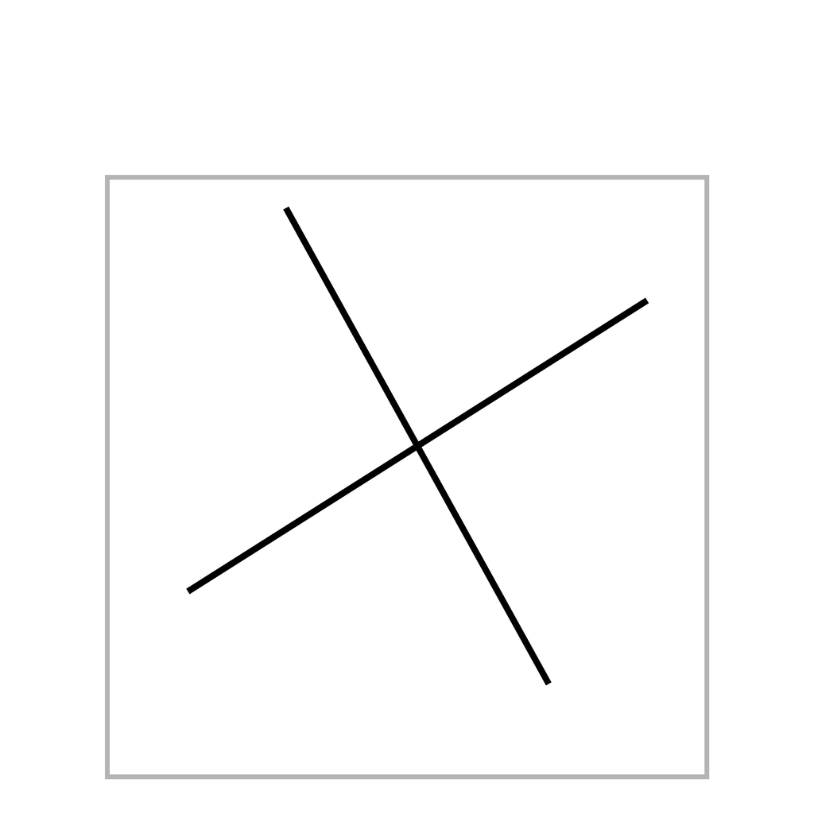
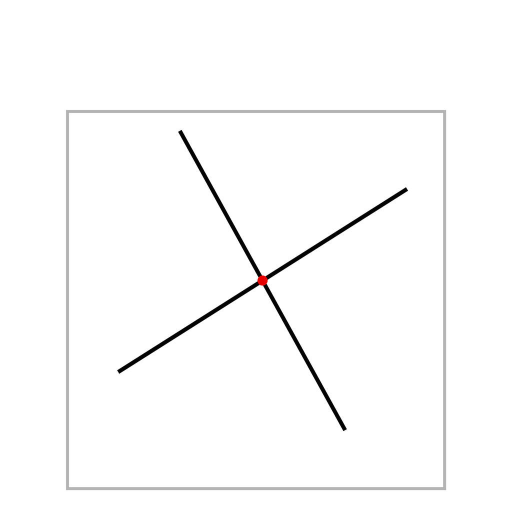

# WISP: Worksheet Image-Space Problem Solving

Code and data for **Image-Space Rule Discovery**, accepted at ACCV 2026.

**Misora Sugiyama · Toya Oyama · Hirokatsu Kataoka**

WISP evaluates whether an image-editing system can solve a worksheet problem by placing the answer on the input image while preserving unrelated content. It covers **11 tasks, five task families, and eight information conditions** on a 1024 × 1024 canvas.

Legacy task IDs and `wisrd` filenames are retained for compatibility.

| Example input | Canonical answer |
|:--:|:--:|
|  |  |

## Release status

Download the fixed data and evaluation materials from [release `data-v1.0.0`](https://github.com/misora-sugiyama/WISP/releases/tag/data-v1.0.0). Checksums are included.

This repository contains the scorer, development renderer, 44 example records, configurations and verification tools. Release packages contain:

- The corrected fixed shared dataset: 2,200 item–condition records referencing 1,100 inputs and 550 GT images.
- Six frozen output archives: 2,200 images per system, 13,200 images in total.
- The 13,200 historical stored row scores and reproducible shared-comparison aggregates.
- FLUX V0–V7 light results: 35,200 stored score rows with heatmap and condition-oracle data, without the 35,200 candidate images.
- Human-evaluation protocols, codebooks and pooled aggregate tables, without individual responses or rater-level records.
- Selected reference/oracle, D/L/P and 280-output reasoning aggregates. Remaining reasoning records and raw additional images/runners are not supplied.

Use the frozen data for paper reproduction; development samples are different instances. Re-scoring all 13,200 frozen images reproduced every stored Strict, Loose and native-format decision without errors. See [package scope](docs/DATA.md), [reproduction steps](docs/REPRODUCE.md) and [human studies](docs/ADDITIONAL.md).

## Quick start

Use Python 3.10 or later. Run commands from the repository root.

```bash
python -m venv .venv
source .venv/bin/activate
python -m pip install -r requirements.txt
python scripts/verify_release.py
python scripts/run_smoke_test.py
```

On Windows, activate with `.venv\Scripts\activate`.

The smoke test checks examples, no-edit controls, the scorer hash and missing-output rejection without model API calls.

### Generate development samples

```bash
python generator/render_wisrd.py --out outputs/new_sample --n-per-task 1 --variants V0 V1 V2 V3
```

Use a fresh output directory. Set `WISP_FONT_PATH` to select a TrueType font. Rendering can vary by font and platform.

### Evaluate model outputs

Save each candidate as `<item-id>.png` (JPEG and WebP are also supported), then run:

```bash
python scripts/evaluate.py --metadata examples/generated_sample/items.jsonl --candidates-dir outputs/model --out outputs/scores.csv
python scripts/summarize_scores.py --scores outputs/scores.csv --out outputs/summary.json
```

The wrapper rejects missing or ambiguous candidates, duplicate IDs and unreadable images. See [reproduction instructions](docs/REPRODUCE.md) to evaluate the fixed shared subset.

## Reported shared V0–V3 results

Paper-reported percentages on the same 2,200 item–condition pairs per system, reproduced from the frozen images:

| System | Role | Auto-Strict | Auto-Loose |
|---|---|---:|---:|
| Nano Banana Pro | End-to-end editor | 48.7 | 64.0 |
| Qwen-Image-Edit | End-to-end editor | 13.4 | 20.4 |
| FLUX.2 Klein 4B API | End-to-end editor | 11.5 | 21.9 |
| FLUX.2 Klein 4B open-weight | End-to-end editor | 11.3 | 21.8 |
| InstructPix2Pix | End-to-end editor | 0.0 | 5.5 |
| OCR+Gemini plan-render | Structured-plan diagnostic | 35.0 | 58.0 |

These are **proxy pass rates**; letter/digit scoring does not recognize glyph identity. Instruction-conditioned success does not establish open-ended rule induction. See [scoring and limitations](docs/SCORING.md).

## Documentation

- [Tasks and information conditions](docs/BENCHMARK.md)
- [Data packages, schema, and generation](docs/DATA.md)
- [Frozen-output reproduction](docs/REPRODUCE.md)
- [Scorer definitions and limitations](docs/SCORING.md)
- [Additional experiments and human studies](docs/ADDITIONAL.md)
- [Source provenance and changes](docs/provenance/RELEASE.md)

## Citation and licenses

Please cite **Image-Space Rule Discovery**, Misora Sugiyama, Toya Oyama, and Hirokatsu Kataoka, ACCV 2026. See [CITATION.cff](CITATION.cff).

Code: [MIT](LICENSE). Data: [CC BY 4.0](DATA_LICENSE.md). Third-party model outputs, model weights and the manuscript are outside the data license's scope.
